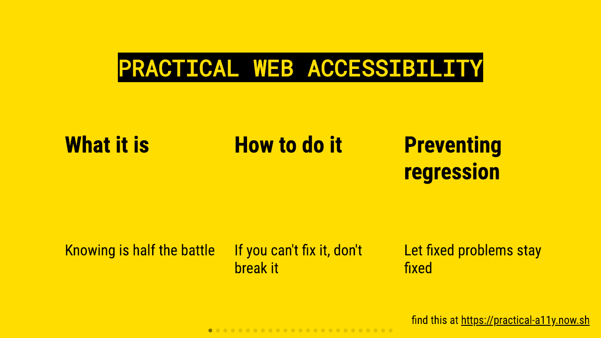

# Practical Web Accessibility



See the latest presentation at [https://practical-a11y.now.sh](practical-a11y.now.sh)

- I presented [this Version](https://boston-php-practical-a11y-iou3vcg5g.now.sh/) at the [BostonPHP Meetup](https://meetup.com/bostonphp/events/257725112/) Jan 23, 2019.
- I presented [this version](https://bos-reactjs-practical-a11y.now.sh/) at [ReactJS Boston](https://www.meetup.com/ReactJS-Boston/events/259015987) meetup Feb 27, 2019.

## The Repository

Initially generated with [mdx-deck][]'s `npm init deck` command.

### Requirements

- NodeJS
- Yarn

### Development

To run the presentation deck in development mode:

```sh
yarn start
```

Edit the [`deck.mdx`](deck.mdx) file to get started.

### Deployment

If you're me, deploy with:

```sh
yarn deploy
```

### Exporting

To build the presentation deck as static HTML:

```sh
yarn build
```

To export a PDF:

```sh
yarn pdf
```

To export an image of the title slide:

```sh
yarn image
```

For more documentation see the [mdx-deck][] repo.

[mdx-deck]: https://github.com/jxnblk/mdx-deck
