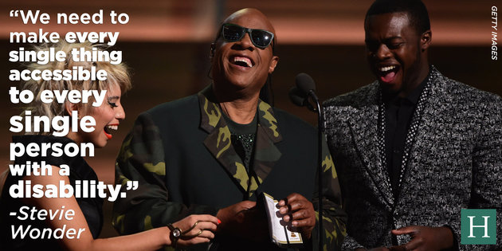

<Image src="https://images.unsplash.com/photo-1524513017549-db6af445c34a?ixlib=rb-1.2.1&ixid=eyJhcHBfaWQiOjEyMDd9&auto=format&fit=crop&w=1910&q=80">
  <Appear>
    <h2>For many, this symbol is the first association with accessibility</h2>
  </Appear>
</Image>

```notes
For many, the handicap symbol is the first association with accessibility.

It's not bad, but we can definitely do better.
```

---



You'd better believe this guy shops online

```notes
if we're looking for a symbol for accessibility, let's start with this guy
```

---
